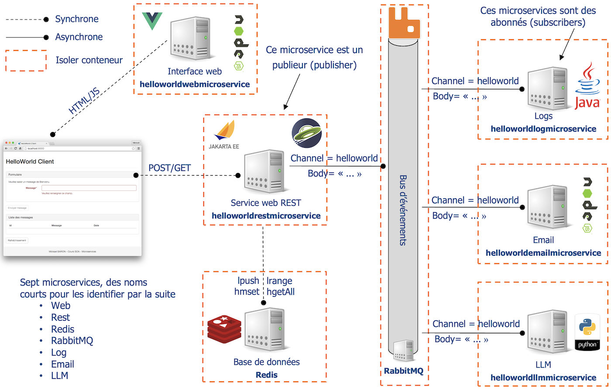

# Tutoriel Java Microservices avec Docker

L'objectif de cette série d'exercices est d'apprendre à construire une application en respectant une architecture à base de microservices en se focalisant sur le langage Java.

Nous utiliserons pour cela plusieurs technologies :

* la bibliothèque KumuluzEE pour packager et exécuter une application microservice respectant la spécification MicroProfile ;
* l'outil Docker pour l'isolation des microservices ;
* la bibliothèque et le serveur RabbitMQ pour la gestion d'un bus d'événements afin que les microservices communiquent de manière asyncrhone ;
* l'outil Docker Compose pour la composition des microservices.

La grande majorité du code contenu dans les microservices vous sera donné comme support dans le répertoire _workspace_. En effet, ces exercices se focaliseront principalement sur les problématiques de déploiement et non sur l’aspect développement.

Dans la suite, on appelle « microservice », un programme qui implémente une fonctionnalité dans un langage donné (par exemple Java) et est isolé dans un conteneur Docker.

**Buts pédagogiques** : développer un microservice avec le langage Java et la spécification MicroProfile, télécharger une image Docker, créer une image Docker, créer un conteneur Docker, faire communiquer plusieurs conteneurs Docker, mettre en place un bus d'événements, composer des microservices avec Docker Compose.

> Ce dépôt est utilisé dans le cadre d'un cours sur les architectures orientées services que je dispense à l'[ISAE-ENSMA](https://www.ensma.fr) et à l'[Université de Poitiers](https://www.univ-poitiers.fr/) en français. Tous les supports de cours et tutoriaux sont disponibles sur ma page Developpez.com : [https://mbaron.developpez.com](https://mbaron.developpez.com/#page_soa).

## Prérequis logiciels

Avant de démarrer cette série d'exercices, veuillez préparer votre environnement de développement en installant les outils suivants :

* [Java via OpenJDK](https://jdk.java.net/ "Java 8 à 11") ;
* [Maven](https://maven.apache.org/ "Maven") ;
* [Eclipse](https://www.eclipse.org/ "Eclipse") ;
* [cURL](https://curl.haxx.se "cURL") ;
* [Docker et Docker Compose](https://www.docker.com/ "Docker").

## Présentation de l'étude de cas

L'étude de cas utilisée est une application permettant de diffuser des messages « HelloWorld ». Elle fournit une interface web pour la saisie et pour la consultation des messages (voir figure ci-dessous).

Sur le schéma proposé sur la figure ci-dessous, nous détaillons la décomposition en microservices de cette application. L'architecture dispose de sept microservices.

* Le microservice **Web** (contenu dans le projet _helloworldwebmicroservice_) fournit à l'utilisateur une interface web. La technologie utilisée sera du HTML/JavaScript pour le client et NodeJS pour créer un petit serveur web.
* Le microservice **Rest** (contenu dans le projet _helloworldrestmicroservice_) a pour rôle de fournir une API de type service web pour le microservice **Web**. Lors de la réception d'un message « HelloWorld » celui-ci est envoyé au microservice **Redis** à des fins de stockage. Il publie également un événement vers le microservice **RabbitMQ**.
* Le microservice **Redis** fournit un serveur Redis pour le stockage des messages « HelloWorld ».
* Le microservice **RabbitMQ** fournit un bus d'événements basé sur RabbitMQ.
* Le microservice **Log** (contenu dans le projet _helloworldlogmicroservice_) s'abonne au bus d'événement et affiche sur la sortie console les événements envoyés.
* Les microservices **Email** et **Twitter** s'abonnent au bus d'événement et envoient respectivement un email ou un « Tweet ». Ces deux microservices ne seront pas traités.

## Ressources

Retrouver les précédentes leçons :

* [Tutoriel sur SOAP-UI pour inspecter et invoquer un service web étendus/SOAP via l’outil SOAP-UI](https://github.com/mickaelbaron/soapui-tutorial) ;
* [Tutoriel sur JAX-WS pour implémenter des services web étendus/SOAP](https://github.com/mickaelbaron/jaxws-tutorial) ;
* [Tutoriel sur JAX-RS pour implémenter des services web REST](https://github.com/mickaelbaron/jaxrs-tutorial) ;
* [Tutoriel sur le développement de WebSocket et de Server-Sent Event avec le langage Java et les bibliothèques JAX-RS et Tyrus](https://github.com/mickaelbaron/streaminghttp-tutorial).

Pour aller plus loin, vous pouvez consulter les ressources suivantes :

* [Support de cours SOA](https://mickael-baron.fr/soa/introduction-soa "Support de cours SOA") ;
* [Support de cours WSDL](https://mickael-baron.fr/soa/decrire-configurer-wsdl "Support de cours WSDL") ;
* [Support de cours SOAP](https://mickael-baron.fr/soa/communiquer-soap "Support de cours SOAP") ;
* [Support de cours JAX-WS](https://mickael-baron.fr/soa/developper-serviceweb-jaxws "Support de cours JAX-WS").
* [Support de cours REST](https://mickael-baron.fr/soa/comprendre-style-architecture-rest "Support de cours REST") ;
* [Support de cours JAX-RS](https://mickael-baron.fr/soa/developper-serviceweb-rest-jaxrs "Support de cours JAX-RS") ;
* [Support de cours sur le Streaming HTTP](https://mickael-baron.fr/soa/introduction-streaminghttp) ;
* [Support de cours sur la mise en œuvre de technologies de Streaming HTTP avec le langage Java](https://mickael-baron.fr/soa/streaminghttp-mise-en-oeuvre) ;
* [Support de cours sur une introduction aux architectures microservices](https://mickael-baron.fr/soa/introduction-microservices "Support de cours sur une introduction aux architectures microservices") ;
* [Support de cours sur les outils et bibliothèques pour la mise en œuvre d'architectures microservices](https://mickael-baron.fr/soa/microservices-mise-en-oeuvre "Support de cours sur les outils et bibliothèques pour la mise en œuvre d'architectures microservices").
