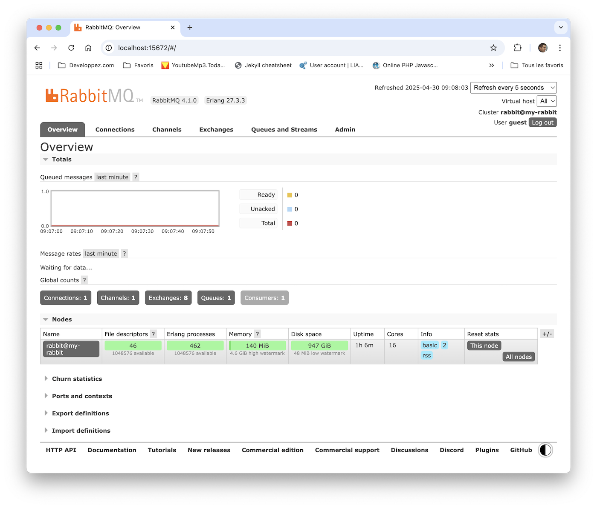

# Exercice 6 : émettre et recevoir des événements

Nous allons enrichir le projet Java du service web *HelloWorld* de façon à ce qu'un message « HelloWorld » puisse être publié sur le bus d'événements de RabbitMQ à chaque fois que le service web de création est appelé. Nous allons également créer un nouveau microservice appelé **Log** (contenu dans le projet *helloworldlogmicroservice*) qui se chargera de réceptionner les événements envoyés au bus d'événements de RabbitMQ. Pour cela, nous allons utiliser un nouveau projet Java pour l'affichage des logs sur la console.

## But

* Publier un HelloWorld vers RabbitMQ.
* Afficher le contenu d'un conteneur Docker.

## Étapes à suivre

* Avant de continuer, nous allons arrêter et supprimer les conteneurs *rest* et *redis*. Exécuter les lignes de commande suivantes.

```bash
$ docker rm -f rest
rest
$ docker rm -f redis
redis
```

* Depuis l'environnement de développement Eclipse, modifier la classe `HelloWorldResource` pour ajouter l'attribut `currentProducer` et le contenu dans la méthode `addHelloWorld`.

```java
@Path("/helloworld")
@Produces(MediaType.APPLICATION_JSON)
@Consumes(MediaType.APPLICATION_JSON)
public class HelloWorldResource {

    @Inject
    @Named("redis")
    private IHelloWorldDAO currentDAO;

    @Inject
    private IHelloWorldEventProducer currentProducer;

    @GET
    public Response getHelloWorlds() {
        return Response.ok(currentDAO.getHelloWorlds()).build();
    }

    @POST
    public Response addHelloWorld(HelloWorld newHelloWorld) {
        if (newHelloWorld != null) {
            newHelloWorld.setStartDate(new Date().toString());
        }

        currentDAO.addHelloWorld(newHelloWorld);
        currentProducer.sendMessage(newHelloWorld);

        return Response.status(Status.CREATED).build();
    }
}
```

* Mettre à jour l'image du microservice **Rest** défini dans le projet *helloworldrestmicroservice*, se placer à la racine du projet *helloworldrestmicroservice* et exécuter la ligne de commande suivante.

```console
$ docker build -t mickaelbaron/helloworldrestmicroservice .
...
```

* Importer le projet Maven *helloworldlogmicroservice* (**File -> Import -> General -> Existing Maven Projects**, choisir le répertoire du projet puis faire **Finish**).

* Examiner la classe `HelloWorldLogMicroservice`. Les événements reçus sont récupérés et affichés sur la sortie console.

* Créer un fichier *Dockerfile* à la racine du projet *helloworldlogmicroservice*.

* Ouvrrir un éditeur de texte et saisir le contenu présenté ci-dessous.

```yaml
FROM java:openjdk-8-jdk
LABEL MAINTAINER="Mickael BARON"

ENV MAVEN_VERSION 3.3.9
RUN curl -fsSLk https://archive.apache.org/dist/maven/maven-3/$MAVEN_VERSION/binaries/apache-maven-$MAVEN_VERSION-bin.tar.gz | tar xzf - -C /usr/share \
    && mv /usr/share/apache-maven-$MAVEN_VERSION /usr/share/maven \
    && ln -s /usr/share/maven/bin/mvn /usr/bin/mvn
ENV MAVEN_HOME /usr/share/maven

ADD pom.xml /work/pom.xml
WORKDIR /work
RUN ["mvn", "dependency:go-offline"]

ADD ["src", "/work/src"]
RUN ["mvn", "package"]

ENTRYPOINT ["java", "-cp", "target/classes:target/dependency/*", "fr.mickaelbaron.helloworldlogmicroservice.HelloWorldLogMicroservice"]
CMD [localhost]
```

* Nous allons construire l'image à partir de fichier *Dockerfile*, exécuter la ligne de commande suivante depuis la racine du projet *helloworldlogmicroservice*.

```console
$ docker build -t mickaelbaron/helloworldlogmicroservice .
... // Des tonnes de lignes
Step 6/12 : ADD pom.xml /work/pom.xml
 ---> bc656dde42fc
Step 7/12 : WORKDIR /work
 ---> Running in 33d8f9fb4cf8
Removing intermediate container 33d8f9fb4cf8
...
```

Vous remarquerez que la construction de l'image commence réellement à partir de l'étape 6. Tout ce qui est avant cette étape est déjà présent dans le cache de Docker.

* Nous ne pouvons pas continuer tant que le serveur RabbitMQ n’est pas mis en place. Nous allons donc l'installer en l'isolant dans un conteneur. Le microservice résultat s'appellera **Rabbitmq**. Nous utiliserons une image de RabbitMQ contenant une interface web pour la gestion des événements reçus et envoyés (*rabbitmq:management*).

```console
docker pull rabbitmq:management
management: Pulling from library/rabbitmq
f17d81b4b692: Pull complete
...
Digest: sha256:3eb2fa0f83914999846f831f14b900c0c85cea8e5d2db48ff73cf7defa12fe96
Status: Downloaded newer image for rabbitmq:management
```

* Il ne nous reste plus qu'à créer tous les conteneurs **rest**, **redis** et **rabbitmq** et de les connecter au réseau Docker *helloworldnetwork*. Exécuter les lignes de commande suivantes en faisant attention d'être à la racine du répertoire _workspace_.

```console
docker run --name redis -d --network helloworldnetwork -v $(pwd)/data:/data redis redis-server --appendonly yes
docker run --name rabbitmq -d --network helloworldnetwork -p 5672:5672 -p 15672:15672 --hostname my-rabbit rabbitmq:management
docker run --name log -d --network helloworldnetwork mickaelbaron/helloworldlogmicroservice rabbitmq
docker run --name rest -d --network helloworldnetwork -p 8080:8080 --env REDIS_HOST=tcp://redis:6379 --env RABBITMQ_HOST=rabbitmq  mickaelbaron/helloworldrestmicroservice
```

* Assurons-nous que tous les conteneurs soient opérationnels en affichant le statut des conteneurs.

```console
$ docker ps
CONTAINER ID        IMAGE                                     COMMAND                  CREATED             STATUS              PORTS                                     NAMES
d3a1e7f0594b        mickaelbaron/helloworldrestmicroservice   "java -cp target/cla…"   4 minutes ago       Up 4 minutes        0.0.0.0:8080->8080/tcp                    rest
3b6430dd7c62        mickaelbaron/helloworldlogmicroservice    "java -cp target/cla…"   13 minutes ago      Up 13 minutes                                                 log
ac2314ccc4bf        rabbitmq:management                       "docker-entrypoint.s…"   16 minutes ago      Up 16 minutes       4369/tcp, ..., 0.0.0.0:15672->15672/tcp   rabbitmq
57f69c0deabe        redis                                     "docker-entrypoint.s…"   16 minutes ago      Up 16 minutes       6379/tcp                                  redis
```

* Assurons-nous également que l'interface d'administration de RabbitMQ fonctionne. Ouvrir un navigateur web et saisir l'adresse (utilisateur : *guest*, mot de passe : *guest*) <http://localhost:15672>.



* Appeler le service web *HelloWorld* pour tester la chaîne complète des microservices en exécutant les deux lignes de commandes.

```console
# Création d'un message « HelloWorld » à partir d'un contenu JSON
$ curl -H "Content-Type: application/json" -X POST -d '{"message":"Mon HelloWorld"}' http://localhost:8080/helloworld

# Lister les messages « HelloWorld »
$ curl http://localhost:8080/helloworld
[{"rid":3,"message":"Mon HelloWorld avec presque tous les microservices","startDate":"Sun Dec 30 21:10:09 UTC 2018"},{"rid":2,"message":"Mon HelloWorld","startDate":"Sat Dec 29 07:38:01 CET 2018"},{"rid":1,"message":"Mon HelloWorld","startDate":"Sat Dec 29 07:30:01 CET 2018"}]
```

* Afficher le contenu des logs du conteneur *log* en exécutant la commande suivante.

```console
$ docker logs log
[x] Received '{"rid":6,"message":"Mon HelloWorld avec presque tous les microservices","startDate":"Sun Dec 30 21:10:09 UTC 2018"}'
```