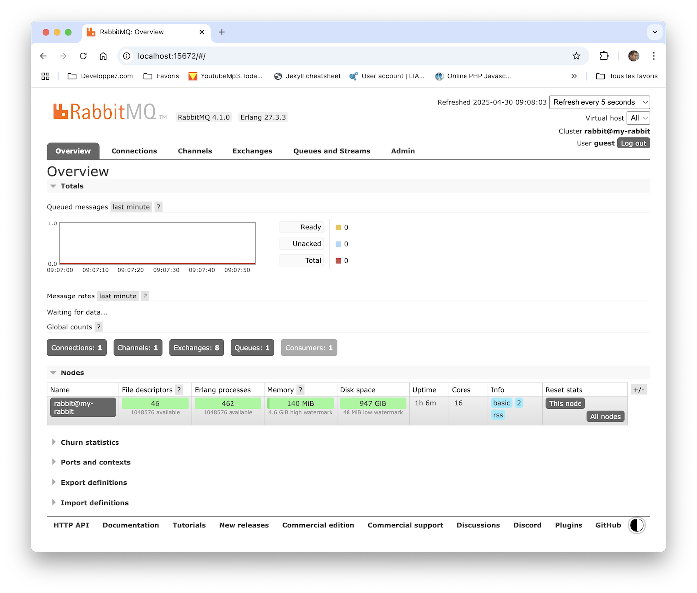

# Exercice 6 : émettre et recevoir des événements

Nous allons enrichir le projet Java du service web _HelloWorld_ de façon à ce qu'un message « HelloWorld » puisse être publié sur le bus d'événements/messages de [RabbitMQ](https://www.rabbitmq.com/) à chaque fois que le service web de création est appelé. Nous allons également créer un nouveau microservice appelé **Log** (contenu dans le projet _helloworldlogmicroservice_) qui se chargera de réceptionner les événements envoyés au bus d'événements de [RabbitMQ](https://www.rabbitmq.com/). Pour cela, nous allons utiliser un nouveau projet Java pour l'affichage des logs sur la console.

## But

- Publier un HelloWorld vers [RabbitMQ](https://www.rabbitmq.com/).
- Afficher le contenu d'un conteneur.

## Étapes à suivre

- Avant de continuer, nous allons arrêter et supprimer les conteneurs _rest_ et _redis_. Exécuter les lignes de commande suivantes.

```bash
docker rm -f rest
docker rm -f redis
```

- Modifier la classe `HelloWorldResource` pour ajouter l'attribut `currentProducer` et le contenu dans la méthode `addHelloWorld`.

```java
@Path("/helloworld")
@Produces(MediaType.APPLICATION_JSON)
@Consumes(MediaType.APPLICATION_JSON)
public class HelloWorldResource {

    @Inject
    @Named("redis")
    private IHelloWorldDAO currentDAO;

    @Inject
    private IHelloWorldEventProducer currentProducer;

    @GET
    public Response getHelloWorlds() {
        return Response.ok(currentDAO.getHelloWorlds()).build();
    }

    @POST
    public Response addHelloWorld(HelloWorld newHelloWorld) {
        if (newHelloWorld != null) {
            newHelloWorld.setStartDate(new Date().toString());
        }

        currentDAO.addHelloWorld(newHelloWorld);
        currentProducer.sendMessage(newHelloWorld);

        return Response.status(Status.CREATED).build();
    }
}
```

- Mettre à jour l'image du microservice **Rest** défini dans le fichier _DockerfileMSB_ du projet _helloworldrestmicroservice_, se placer à la racine du projet _helloworldrestmicroservice_ et exécuter la ligne de commande suivante.

```bash
docker build -t mickaelbaron/helloworldrestmicroservice:msb -f DockerfileMSB .
```

La sortie console attendue :

```bash
[+] Building 25.5s (17/17) FINISHED                                                                              docker:desktop-linux
 => [internal] load build definition from DockerfileMSB                                                                          0.0s
 => => transferring dockerfile: 1.21kB                                                                                           0.0s
 => [internal] load metadata for docker.io/openliberty/open-liberty:kernel-slim-java11-openj9-ubi-minimal                        0.3s
 => [internal] load metadata for docker.io/library/maven:3.9.9-eclipse-temurin-11                                                1.5s
 => [internal] load .dockerignore                                                                                                0.0s
 => => transferring context: 2B                                                                                                  0.0s
 => [build-java-stage 1/6] FROM docker.io/library/maven:3.9.9-eclipse-temurin-11@sha256:...                                      0.0s
 => => resolve docker.io/library/maven:3.9.9-eclipse-temurin-11@sha256:...                                                       0.0s
 => [internal] load build context                                                                                                0.0s
 => => transferring context: 7.27kB                                                                                              0.0s
 => [stage-1 1/5] FROM docker.io/openliberty/open-liberty:kernel-slim-java11-openj9-ubi-minimal@sha256:...                       0.2s
 => => resolve docker.io/openliberty/open-liberty:kernel-slim-java11-openj9-ubi-minimal@sha256:...                               0.2s
 => CACHED [build-java-stage 2/6] ADD pom.xml /work/pom.xml                                                                      0.0s
 => CACHED [build-java-stage 3/6] WORKDIR /work                                                                                  0.0s
 => CACHED [build-java-stage 4/6] RUN ["mvn", "dependency:go-offline"]                                                           0.0s
 => [build-java-stage 5/6] ADD [src, /work/src]                                                                                  0.0s
 => [build-java-stage 6/6] RUN ["mvn", "package"]                                                                                1.6s
 => CACHED [stage-1 2/5] COPY --chown=1001:0 --from=build-java-stage /work/src/main/liberty/config/server.xml /config/server.xml 0.0s
 => [stage-1 3/5] COPY --chown=1001:0 --from=build-java-stage /work/target/helloworldrestmicroservice.war /config/apps/          0.0s
 => [stage-1 4/5] RUN features.sh                                                                                               15.3s
 => [stage-1 5/5] RUN configure.sh                                                                                               6.2s
 => exporting to image                                                                                                           0.7s
 => => exporting layers                                                                                                          0.5s
 => => exporting manifest sha256:d9d92a782b4706fda598fa0e41ca7417210cdc31197f7d9a7c9d394c9088216a                                0.0s
 => => exporting config sha256:244c5366bd09b8aee69e76c5eab11c1fc9b0c7aca8f48d13c19a02b295d5966e                                  0.0s
 => => exporting attestation manifest sha256:1bcbc518eb9488ad6308e8d99a055f647ea535322823ac5be44775f51b045d90                    0.0s
 => => exporting manifest list sha256:b0fcad39209226b726f89651a198c524cdcddb7eb6d632d1f7dea4936b17aba9                           0.0s
 => => naming to docker.io/mickaelbaron/helloworldrestmicroservice:msb                                                           0.0s
 => => unpacking to docker.io/mickaelbaron/helloworldrestmicroservice:msb                                                        0.2s
```

- Ouvrir le projet Maven _helloworldlogmicroservice_ depuis l'éditeur [VSCode](https://code.visualstudio.com/ "Visual Studio Code").

- Examiner la classe `HelloWorldLogMicroservice`. Les événements reçus sont récupérés et affichés sur la sortie console.

- Créer un fichier _Dockerfile_ à la racine du projet _helloworldlogmicroservice_ et saisir le contenu présenté ci-dessous.

```yaml
# Build env
FROM maven:3-jdk-11-slim AS build-java-stage
LABEL MAINTAINER="Mickael BARON"

COPY pom.xml /work/pom.xml
WORKDIR /work
RUN ["mvn", "dependency:go-offline"]

COPY src /work/src
RUN ["mvn", "package"]

# Run env
FROM openjdk:11-jre-slim
COPY --from=build-java-stage /work/target/classes /classes/
COPY --from=build-java-stage /work/target/dependency/*.jar /dependency/

ENTRYPOINT ["java", "-cp", "classes:dependency/*", "fr.mickaelbaron.helloworldlogmicroservice.HelloWorldLogMicroservice"]
CMD ["localhost"]
```

- Nous allons construire l'image à partir de fichier _Dockerfile_. Exécuter la ligne de commande suivante depuis la racine du projet _helloworldlogmicroservice_.

```bash
docker build -t mickaelbaron/helloworldlogmicroservice .
```

La sortie console attendue :

```bash
[+] Building 83.2s (15/15) FINISHED                                          docker:desktop-linux
 => [internal] load build definition from Dockerfile                                         0.0s
 => => transferring dockerfile: 609B                                                         0.0s
 => [internal] load metadata for docker.io/library/openjdk:11-jre-slim                       1.3s
 => [internal] load metadata for docker.io/library/maven:3-jdk-11-slim                       1.3s
 => [internal] load .dockerignore                                                            0.0s
 => => transferring context: 2B                                                              0.0s
 => CACHED [build-java-stage 1/6] FROM docker.io/library/maven:3-jdk-11-slim@sha256:...      0.0s
 => => resolve docker.io/library/maven:3-jdk-11-slim@sha256:...                              0.0s
 => CACHED [stage-1 1/3] FROM docker.io/library/openjdk:11-jre-slim@sha256:...               0.0s
 => => resolve docker.io/library/openjdk:11-jre-slim@sha256:...                              0.0s
 => [internal] load build context                                                            0.0s
 => => transferring context: 1.02kB                                                          0.0s
 => [build-java-stage 2/6] ADD pom.xml /work/pom.xml                                         0.0s
 => [build-java-stage 3/6] WORKDIR /work                                                     0.0s
 => [build-java-stage 4/6] RUN ["mvn", "dependency:go-offline"]                             80.6s
 => [build-java-stage 5/6] ADD [src, /work/src]                                              0.0s
 => [build-java-stage 6/6] RUN ["mvn", "package"]                                            1.1s
 => [stage-1 2/3] COPY --from=build-java-stage /work/target/classes /classes/                0.0s
 => [stage-1 3/3] COPY --from=build-java-stage /work/target/dependency/*.jar /dependency/    0.0s
 => exporting to image                                                                       0.1s
 => => exporting layers                                                                      0.0s
 => => exporting manifest sha256:...                                                         0.0s
 => => exporting config sha256:...                                                           0.0s
 => => exporting attestation manifest sha256:...                                             0.0s
 => => exporting manifest list sha256:...                                                    0.0s
 => => naming to docker.io/mickaelbaron/helloworldlogmicroservice:latest                     0.0s
 => => unpacking to docker.io/mickaelbaron/helloworldlogmicroservice:latest                  0.0s
 ```

- La mise en place du serveur [RabbitMQ](https://www.rabbitmq.com/) est obligatoire pour poursuivre. Il sera installé dans un conteneur isolé. Le microservice correspondant portera le nom **Rabbitmq**. L’image utilisée (`rabbitmq:management`) inclut une interface web permettant de gérer les événements reçus et envoyés.

```bash
docker pull rabbitmq:management
```

- Il ne nous reste plus qu'à créer tous les conteneurs _rest_, _redis_ et _rabbitmq_ et de les connecter au réseau Docker _helloworldnetwork_. Exécuter les lignes de commande suivantes en faisant attention d'être à la racine du répertoire _workspace_.

```bash
docker run --name redis -d --network helloworldnetwork -v $(pwd)/data:/data redis redis-server --appendonly yes
docker run --name rabbitmq -d --network helloworldnetwork -p 15672:15672 --hostname my-rabbit rabbitmq:management
docker run --name log -d --network helloworldnetwork mickaelbaron/helloworldlogmicroservice amqp://rabbitmq:5672
docker run --name rest -d --network helloworldnetwork -p 9080:9080 --env REDIS_HOST=tcp://redis:6379 --env RABBITMQ_HOST=amqp://rabbitmq:5672 mickaelbaron/helloworldrestmicroservice:msb
```

- Assurons-nous que tous les conteneurs soient opérationnels en affichant le statut des conteneurs.

```bash
docker ps
```

La sortie console attendue :

```bash
CONTAINER ID   IMAGE                                         COMMAND                  CREATED         STATUS         PORTS                                  NAMES
5d3d9a7dbc69   mickaelbaron/helloworldrestmicroservice:msb   "/opt/ol/helpers/run…"   2 minutes ago   Up 2 minutes   0.0.0.0:9080->9080/tcp, 9443/tcp       rest
05a5018805aa   mickaelbaron/helloworldlogmicroservice        "java -cp classes:de…"   2 minutes ago   Up 2 minutes                                          log
83eb979c7bea   rabbitmq:management                           "docker-entrypoint.s…"   3 minutes ago   Up 3 minutes   ..., 0.0.0.0:15672->15672/tcp          rabbitmq
72598456d104   redis                                         "docker-entrypoint.s…"   3 minutes ago   Up 3 minutes   6379/tcp                               redis
```

- Assurons-nous également que l'interface d'administration de RabbitMQ fonctionne. Ouvrir un navigateur web et saisir l'adresse (utilisateur : _guest_, mot de passe : _guest_) <http://localhost:15672>.



- Appeler le service web _HelloWorld_ pour tester la chaîne complète des microservices.

```bash
# Création d'un message « HelloWorld » à partir d'un contenu JSON.
curl -H "Content-Type: application/json" -X POST -d '{"message":"Mon HelloWorld"}' http://localhost:9080/helloworld
```

- Exécuter la seconde commande qui récupère les messages « HelloWorld » envoyés.

```bash
# Lister les messages « HelloWorld ».
curl http://localhost:9080/helloworld
```

La sortie console attendue :

```bash
[{"message":"Mon HelloWorld","rid":1,"startDate":"Wed Apr 30 07:10:22 GMT 2025"}]
```

- Afficher le contenu des logs du conteneur _log_.

```bash
docker logs log
```

La sortie console attendue :

```bash
Great !! Connected to RabbitMQ.
 [x] Received '{"rid":2,"message":"Mon HelloWorld","startDate":"Wed Apr 30 07:10:22 GMT 2025"}'
```

## Avez-vous bien compris ?

Pour continuer sur les concepts présentés dans cet exercice, nous proposons l'expérimentation suivante :

- développer un microservice appelé **Email** qui permet d'envoyer un email (à vous de choisir à qui il doit être envoyé) quand un événement est envoyé.
