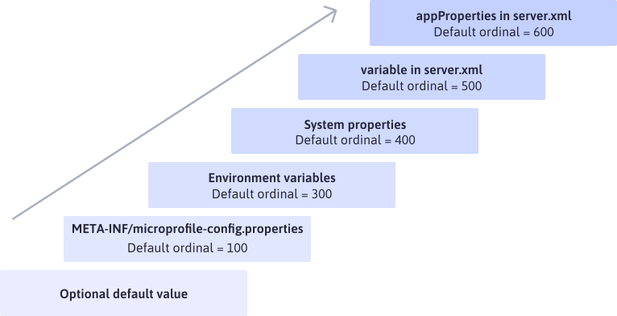

# Exercice 8 : gérer la configuration 

La spécification [MicroProfile](https://microprofile.io/) introduit la fonctionnalité [Config](https://github.com/microprofile/microprofile-config) qui permet de gérer la configuration autrement qu'avec des variables d'environnement. Elle prend en charge plusieurs sources de configuration, comme illustré ci-dessous.



Dans la suite de cet exercice, nous montrons comment activer la fonctionnalité [Config](https://github.com/microprofile/microprofile-config) et comment l'intégrer dans le code du microservice **Rest** associé au projet Maven _helloworldrestmicroservice_.

## But

- Activer et implémenter la fonctionnalité [Config](https://github.com/microprofile/microprofile-config).

## Étapes à suivre

Activer la fonctionnalité [Config](https://github.com/microprofile/microprofile-config) sur le serveur [Open Liberty](https://openliberty.io/).

- Depuis le projet Maven _helloworldrestmicroservice_, ouvrir le fichier _src/liberty/config/server.xml_ et ajouter la fonctionnalité `mpConfig` à la suite des fonctionnalités déclarées dans la balise `<featureManager>`.

```xml
<server description="Sample Liberty server">
    <featureManager>
        <platform>jakartaee-10.0</platform>
        <platform>microprofile-7.0</platform>
        ...
        <feature>mpConfig</feature>
    </featureManager>
    <variable name="http.port" defaultValue="9080" />
    ...
</server>
```

Deux classes doivent être impactées. La première `fr.mickaelbaron.helloworldrestmicroservice.dao.redis.JedisFactory` qui permet de se connecter à la base [Redis](https://redis.io/) et la seconde `fr.mickaelbaron.helloworldrestmicroservice.event.rabbitmq.RabbitMQFactory` qui permet de se connecter à [RabbitMQ](https://www.rabbitmq.com/).

- Éditer la classe `fr.mickaelbaron.helloworldrestmicroservice.dao.redis.JedisFactory` et modifier par le code suivant :

```java
@ApplicationScoped
public class JedisFactory {

    private static final String REDIS_HOST_ENV = "REDIS_HOST";

    private JedisPool jedisPool;

    @Inject
    @ConfigProperty(name = REDIS_HOST_ENV, defaultValue = "tcp://localhost:6379")
    private String redisHost;

    @PostConstruct
    public void init() {
        URI redisURI = getRedisURI();
        jedisPool = new JedisPool(new JedisPoolConfig(), redisURI);
    }

    public Jedis getJedis() {
        return jedisPool.getResource();
    }

    private URI getRedisURI() {
        return URI.create(redisHost);
    }
}
```

L'annotation `@ConfigProperty` permet d'extraire la valeur de `REDIS_HOST` en fonction de la disponibilité des sources de configuration. Si aucune source ne transmet une valeur, c'est la valeur par défaut qui sera choisie. Par ailleurs, vous remarquerez que le constructeur `JedisFactory()` a été remplacé par la méthode `init()` annotée avec `@PostConstruct`. En effet, l'injection de dépendance ne peut se réaliser qu'une fois le constructeur de la classe invoquée.

- Éditer la classe `fr.mickaelbaron.helloworldrestmicroservice.event.rabbitmq.RabbitMQFactory` et modifier par le code suivant :

```java
@ApplicationScoped
public class RabbitMQFactory {

	private static final String RABBITMQ_HOST_ENV = "RABBITMQ_HOST";

	public static final String EXCHANGE_NAME = "helloworld";

	private Channel currentChanel;

	@Inject
	@ConfigProperty(name = RABBITMQ_HOST_ENV, defaultValue = "amqp://localhost:5672")
	private String rabbitmqHost;

	@PostConstruct
	public void init() {
    ...
	}

	public Channel getChannel() {
		return currentChanel;
	}

	private URI getRedisURI() {
		return URI.create(rabbitmqHost);
	}
}

```

- Arrêter tous les services avant de continuer depuis le répertoire _workspace_.

```bash
docker compose down
```

La sortie console attendue :

```bash
[+] Running 6/6
 ✔ Container workspace-web-1       Removed      0.2s
 ✔ Container workspace-rest-1      Removed      1.4s
 ✔ Container workspace-log-1       Removed      0.0s
 ✔ Container workspace-rabbitmq-1  Removed      1.2s
 ✔ Container workspace-redis-1     Removed      0.1s
 ✔ Network helloworldnetwork       Removed
```

- Pour recompiler uniquement l'image du microservice **Rest**, exécuter la ligne de commande suivante.

```bash
docker compose build rest
```

La sortie console attendue :

```bash
[+] Building 2.4s (19/19) FINISHED
...
[+] Building 1/1
✔ mickaelbaron/helloworldrestmicroservice:msb  Built         0.0s
```

- Pour recréer les conteneurs, exécuter la ligne de commande suivante.

```bash
docker compose up -d
```

La sortie console attendue :

```bash
NAME                   COMMAND                  SERVICE             STATUS              PORTS
workspace-log-1        "java -cp classes:de…"   log                 running
workspace-rabbitmq-1   "docker-entrypoint.s…"   rabbitmq            running (healthy)   0.0.0.0:5672->5672/tcp, 0.0.0.0:15672->15672/tcp
workspace-redis-1      "docker-entrypoint.s…"   redis               running (healthy)   6379/tcp
workspace-rest-1       "java -cp classes:de…"   rest                running             0.0.0.0:9080->9080/tcp
workspace-web-1        "/docker-entrypoint.…"   web                 running             0.0.0.0:80->80/tcp
```
