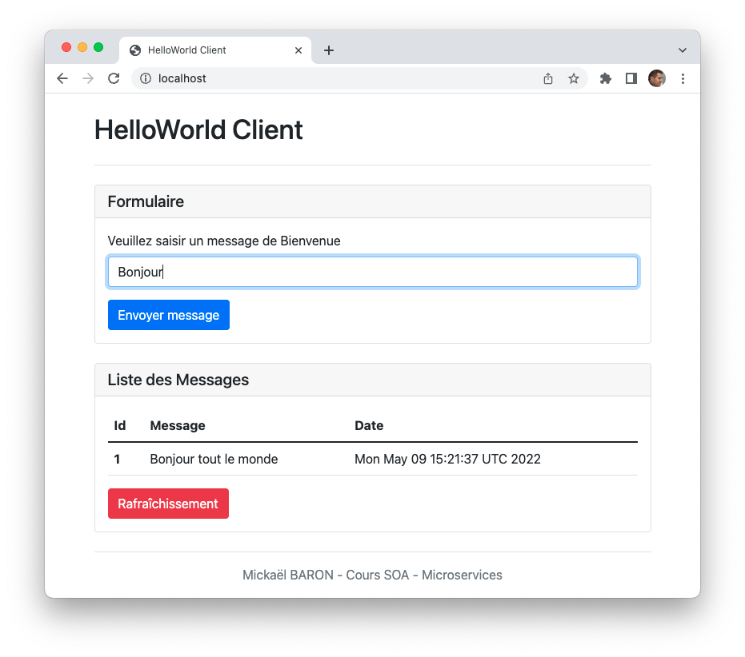

# Microservices demo with Java, Docker, Docker Compose, RabbitMQ, KumuluzEE, JAX-RS, CDI, Redis, JRedis.

An example of architecture based on microservices for building a simple HelloWorld application. Below, a screenshot of the main user interface.

Scenario is obvious: you input a HelloWorld message and you submit it. All the HelloWorld messages are listed on the table.



The architecture of this application is composed of five microservices.

* The **Web** microservice to supply user interface (_helloworldwebmicroservice_ project). Technologies: HTML,JavaScript and Node.JS
* The **Rest** microservice (_helloworldrestmicroservice_ project) to supply a REST API. Technologies: Java, RabbitMQ client, JRedis, KumuluzEE, CDI and JAX-RS.  
* The **Redis** microservice to store data. Technology: Redis server.
* The **RabbitMQ** microservice to store event bus. Technology: RabbitMQ server.
* The **Log** microservice (_helloworldlogmicroservice_ project) to create logs. Technology: Java, RabbitMQ client.

## Prerequisites

* Docker (latest version)
* Docker Compose (latest version)

## How to Run

At the root of the project execute the following shell command.

```bash
docker-compose up -d
```

After the local deployment, you can check if the docker containers are working.

```bash
docker-compose ps
```

## How to execute

Open your favorite web browser and go to this URL: <http://localhost>

To check if the **Log** microservice is working, display its console output

```bash
docker logs log_1
```
